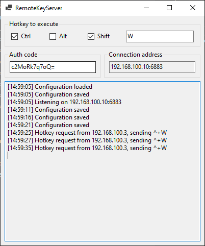

# RemoteKey

Send remote keyboard shortcuts to your computer via UDP.

This is a small .NET Core application for Windows that listens on UDP port 6883, and when a properly formatted datagram arrives, it emits a predefined keyboard shortcut. Useful for remote controlling an application on your desktop from your laptop or mobile.

## Build

Requires .NET Core SDK 3.1.

Clone and build the application via Visual Studio Code or command line:

    > git clone git@github.com/peterbudai/remotekey.git RemoteKey
    > cd RemoteKey
    > dotnet build

## Usage

Start the application `bin/Debug/netcoreapp3.1/RemoteKeyServer.exe`.

Set your desired keyboard shortcut. A new authentication code will be generated for you when the application started for the first time. The application displays the IP address and port it listens on for UDP packets.

Grab your remote device and start sending datagrams to the specified endpoint. The payload of the UDP datagram must be the authentication code, this ensures that no one else can take over your desktop.

I tested it with [UDP/TCP Widget](https://play.google.com/store/apps/details?id=com.KJM.UDP_Widget) application on Android. You can set up 

### Configuration

You can change the keyboard shortcut that will be emitted, and change the authentication code via the UI or via configuration file `RemoteKeyServer.dll.config` found in the same directory as your application.

    <?xml version="1.0" encoding="utf-8"?>
    <configuration>
        <appSettings>
            <add key="HotKey" value="^+W" />
            <add key="AuthCode" value="c2MoRk7q7oQ=" />
        </appSettings>
    </configuration>

The `AuthCode` can be any string, it is advised to choose a long, random-looking one. The `HotKey` uses the [SendKeys syntax](https://docs.microsoft.com/en-us/dotnet/api/system.windows.forms.sendkeys?view=netcore-3.1).

## License

[MIT License](LICENSE)
